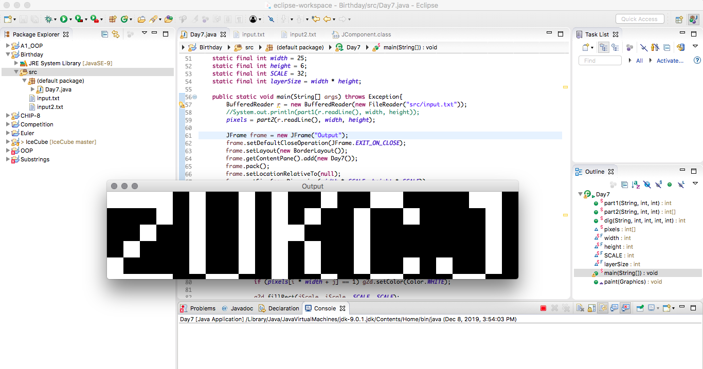

# AdventOfCode2019

> Advent of Code is an Advent calendar of small programming puzzles for a variety of skill sets and skill levels that can be solved in any programming language you like. People use them as a speed contest, interview prep, company training, university coursework, practice problems, or to challenge each other.

My solutions to the [2019 Advent of Code](https://adventofcode.com/2019). All solutions are original, and are written in the Java programming language.
  
Link | Part 1 | Part 2 | Tactic (w/ link to my solution) | Notes
:------------ | :-------------| :-------------| :-------------|:-------------|
[Day 1](https://adventofcode.com/2019/day/1)| :heavy_check_mark: |  :heavy_check_mark: | [Implementation](https://github.com/boriskurikhin/AdventOfCode2019/blob/master/Day1.java) |
[Day 2](https://adventofcode.com/2019/day/2) | :heavy_check_mark: |  :heavy_check_mark: | [Ad Hoc - ish](https://github.com/boriskurikhin/AdventOfCode2019/blob/master/Day2.java) |
[Day 3](https://adventofcode.com/2019/day/3) | :heavy_check_mark: |  :heavy_check_mark: | [Graph Theory?](https://github.com/boriskurikhin/AdventOfCode2019/blob/master/Day3.java) | Clever hashmap implementation
[Day 4](https://adventofcode.com/2019/day/4) | :heavy_check_mark: |  :heavy_check_mark: | [Clever Implementation](https://github.com/boriskurikhin/AdventOfCode2019/blob/master/Day4.java) | 
[Day 5](https://adventofcode.com/2019/day/5) | :heavy_check_mark: |  :heavy_check_mark: | [Ad Hoc / Implementation](https://github.com/boriskurikhin/AdventOfCode2019/blob/master/Day5.java) |
[Day 6](https://adventofcode.com/2019/day/6) | :heavy_check_mark: |  :heavy_check_mark: | [Recursion](https://github.com/boriskurikhin/AdventOfCode2019/blob/master/Day6.java) |
[Day 7](https://adventofcode.com/2019/day/7) | :heavy_check_mark: |  :heavy_check_mark: [(w/ help)](https://github.com/akaritakai/AdventOfCode2019/blob/master/src/main/java/net/akaritakai/aoc2019/Puzzle07.java) | [Multithreading](https://github.com/boriskurikhin/AdventOfCode2019/blob/master/Day7.java) | For part 2, I studied [akaritakai](https://github.com/akaritakai)'s solution in order to write mine
[Day 8](https://adventofcode.com/2019/day/8) | :heavy_check_mark: |  :heavy_check_mark: | [Image Processing-ish](https://github.com/boriskurikhin/AdventOfCode2019/blob/master/Day8.java) |
[Day 9](https://adventofcode.com/2019/day/9) | :heavy_check_mark: |  :heavy_check_mark: | [Ad Hoc](https://github.com/boriskurikhin/AdventOfCode2019/blob/master/Day9.java) | Uses 95% of my code from Part 7
[Day 10](https://adventofcode.com/2019/day/10) | :heavy_check_mark: |  :heavy_check_mark: | [Math - Trigonometry](https://github.com/boriskurikhin/AdventOfCode2019/blob/master/Day10.cpp) | Did this one in C++
[Day 11](https://adventofcode.com/2019/day/11) |  |  |  | Haven't looked at it yet
[Day 12](https://adventofcode.com/2019/day/12) | :heavy_check_mark: | :heavy_check_mark: | [Math](https://github.com/boriskurikhin/AdventOfCode2019/blob/master/Day12.java) | For part 2, I tracked how long it takes for each axis to repeat states, and then performed an LCM on the 3 derived values
&nbsp;&nbsp;&nbsp;&nbsp;&nbsp;&nbsp;&nbsp;&nbsp;&nbsp;&nbsp;&nbsp;&nbsp;&nbsp; | &nbsp;&nbsp;&nbsp;&nbsp;&nbsp;&nbsp;&nbsp;&nbsp;&nbsp;&nbsp;&nbsp;&nbsp;&nbsp;&nbsp;&nbsp;&nbsp;&nbsp;&nbsp;&nbsp;&nbsp;&nbsp;&nbsp;&nbsp;&nbsp; | &nbsp;&nbsp;&nbsp;&nbsp;&nbsp;&nbsp;&nbsp;&nbsp;&nbsp;&nbsp;&nbsp;&nbsp;&nbsp;&nbsp;&nbsp;&nbsp;&nbsp;&nbsp;&nbsp;&nbsp;&nbsp;&nbsp;&nbsp;&nbsp; | | 

I solve the puzzles whenever I have free time or feel like bending my brain. **I am not competing!**

## Extras

Here is what my Day 8 solution visually looks like. We can derive string "ZUKCJ" from the generated image.

